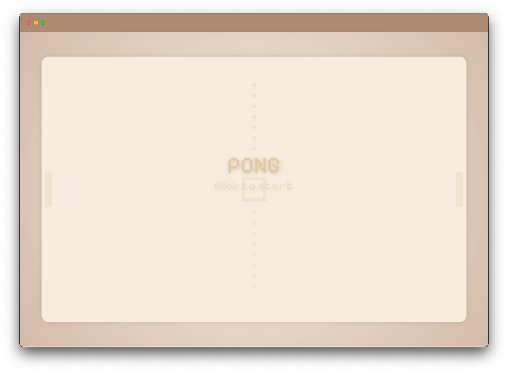

# Minesweeper

Typescript implementation of [MineSweeper](https://en.wikipedia.org/wiki/Minesweeper_(video_game)).
Following the Windows 98 version.

    

        
    

	<a href="https://leandrosq.github.io/js-minesweeper/">Live demo here</a>

## About

A hacky but fun project, I challenged myself to achieve the design aesthetic of the Windows 98 version of Minesweeper with PureJS, which apart from the numbers I got pretty close. At the end I replaced the use of a special font for images, which allowed for multiple color schemes.

## How to play

- Left click to reveal a cell
- Right click to flag a cell
- Click on the face button to restart the game

## Project

| Name | Description |
| -- | -- |
| Eslint | For linting and semantic analysis |
| Prettier | For code formatting |
| Browser sync | For live reloading |
| Esbuild | For bundling |
| gulp | For task automation |
| SASS | For CSS preprocessing |
| Github actions | For CI, building and deploying to github pages |
