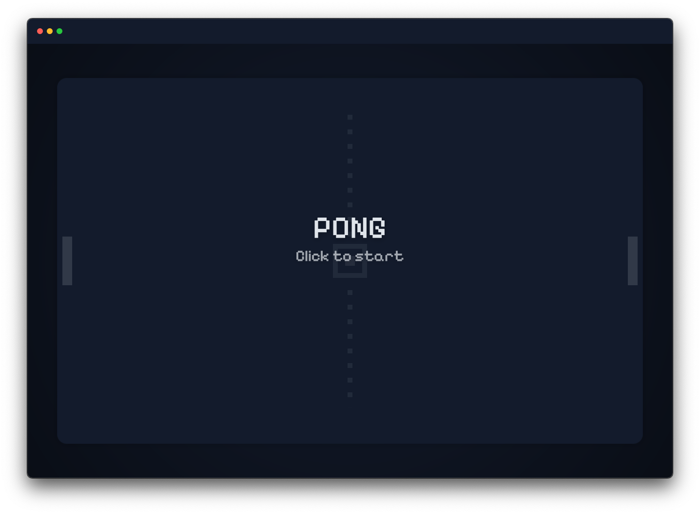

# PONG

Typescript implementation of the [Pong](https://en.wikipedia.org/wiki/Pong) game.

    

        
		
    

	<a href="https://leandrosq.github.io/js-pong/">Live demo here</a>

## About

This project is a simple implementation of the classic Pong game using Typescript, HTML and CSS.
For Audio it uses the WEB Audio API, using oscillators to generate the sounds at runtime.

## How to play

Use the mouse to control the paddle and try to score as many points as possible.

## Used in this project

| Name | Description |
| -- | -- |
| Eslint | For linting and semantic analysis |
| Prettier | For code formatting |
| Browser sync | For live reloading |
| Esbuild | For bundling |
| gulp | For task automation |
| SASS | For CSS preprocessing |
| Github actions | For CI, building and deploying to github pages |
| Google fonts | For the [Pixelify Sans font](https://fonts.google.com/specimen/Pixelify+Sans) |
| Google Icons | For the [Sport tennis icon](https://fonts.google.com/icons?selected=Material%20Symbols%20Outlined%3Asports_tennis%3AFILL%400%3Bwght%40400%3BGRAD%400%3Bopsz%4024) used as favicon |
| [Real favicon generator](https://realfavicongenerator.net/) | For generating the favicon |
